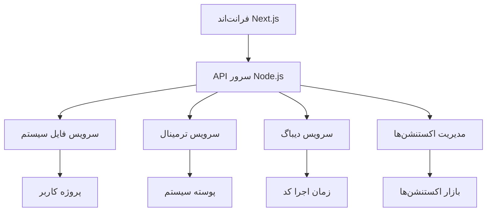

# سند طراحی IDE تحت وب

## بررسی اجمالی

این سند طراحی یک IDE تحت وب شبیه VSCode را توصیف می‌کند که در مرورگر اجرا می‌شود. این IDE قابلیت‌های کامل ویرایش کد، مدیریت فایل‌ها، ترمینال، دیباگ و پشتیبانی از اکستنشن‌ها را ارائه می‌دهد.

## معماری

سیستم از معماری کلاینت-سرور استفاده می‌کند که در آن:

- **فرانت‌اند**: یک برنامه React/Next.js که UI IDE را ارائه می‌دهد
- **بک‌اند**: یک سرور درونی nextjs که عملیات فایل سیستم، ترمینال و دیباگ را مدیریت می‌کند
- **سرویس‌های خارجی**: Git، package managers و سایر سرویس‌ها

### نمودار معماری



## کامپوننت‌ها و رابط‌ها

### 1. ویرایشگر کد (Code Editor)

- **موناکو ادیتور**: ویرایشگر کد مبتنی بر مرورگر با هایلایت سینتکس و تکمیل خودکار
- **رابط**: `EditorComponent` - کامپوننت React که موناکو ادیتور را می‌پوشاند
- **قابلیت‌ها**: ویرایش چند زبانه، هایلایت سینتکس، تکمیل خودکار، خطاهای سینتکس

### 2. اکسپلورر فایل (File Explorer)

- **کامپوننت**: `FileExplorer` - نمایش درختی فایل‌ها و پوشه‌ها
- **رابط**: `FileSystemAPI` - API برای عملیات CRUD روی فایل‌ها
- **قابلیت‌ها**: ایجاد/حذف/تغییر نام فایل‌ها، درگ و دراپ، جستجو

### 3. ترمینال (Terminal)

- **xterm.js**: ترمینال مبتنی بر مرورگر
- **کامپوننت**: `TerminalComponent` - رابط ترمینال
- **رابط**: `TerminalAPI` - API برای اجرای دستورات پوسته
- **قابلیت‌ها**: چندین تب ترمینال، تاریخچه دستورات، خروجی رنگی

### 4. دیباگر (Debugger)

- **کامپوننت**: `DebuggerPanel` - پنل دیباگ با کنترل‌های اجرا
- **رابط**: `DebugAPI` - API برای کنترل دیباگ
- **پشتیبانی**: نقاط توقف، مشاهده متغیرها، اجرای مرحله‌ای

### 5. مدیریت اکستنشن (Extension Manager)

- **کامپوننت**: `ExtensionManager` - مدیریت نصب و حذف اکستنشن‌ها
- **رابط**: `ExtensionAPI` - API برای بارگذاری و اجرای اکستنشن‌ها
- **قابلیت‌ها**: بازار اکستنشن، فعال/غیرفعال کردن، به‌روزرسانی

### 6. کنترل‌پنل Git (Git Control Panel)

- **کامپوننت**: `GitPanel` - رابط Git برای عملیات version control
- **رابط**: `GitAPI` - API برای اجرای دستورات Git
- **قابلیت‌ها**: status، commit، push/pull، branch management

## مدل‌های داده

### مدل فایل (File)

```typescript
interface File {
  id: string;
  name: string;
  path: string;
  content: string;
  type: "file" | "directory";
  language?: string;
  size: number;
  lastModified: Date;
}
```

### مدل پروژه (Project)

```typescript
interface Project {
  id: string;
  name: string;
  rootPath: string;
  files: File[];
  settings: ProjectSettings;
  gitInfo?: GitInfo;
}
```

### مدل ویرایشگر (EditorState)

```typescript
interface EditorState {
  activeFileId: string | null;
  openFiles: string[];
  cursorPosition: { line: number; column: number };
  selection?: { start: Position; end: Position };
  viewState?: monaco.editor.ICodeEditorViewState;
}
```

### مدل ترمینال (TerminalSession)

```typescript
interface TerminalSession {
  id: string;
  title: string;
  processId?: string;
  history: string[];
  currentDirectory: string;
  isActive: boolean;
}
```

### مدل دیباگ (DebugSession)

```typescript
interface DebugSession {
  id: string;
  status: "inactive" | "running" | "paused" | "terminated";
  breakpoints: Breakpoint[];
  currentFrame?: StackFrame;
  variables: Variable[];
}
```

### مدل اکستنشن (Extension)

```typescript
interface Extension {
  id: string;
  name: string;
  publisher: string;
  version: string;
  description: string;
  installed: boolean;
  enabled: boolean;
  manifest: ExtensionManifest;
}
```
